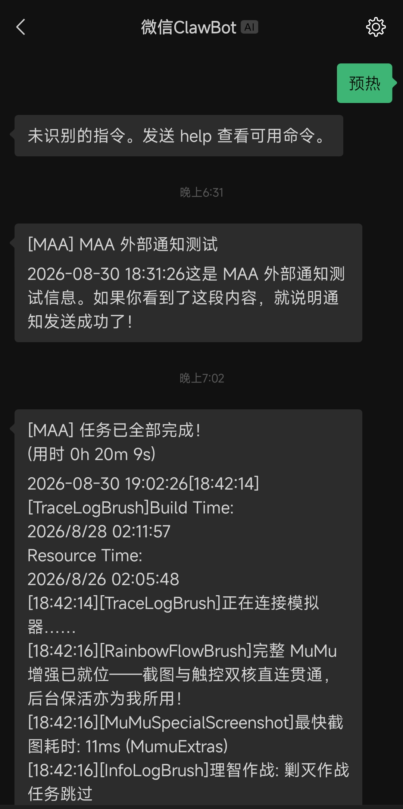
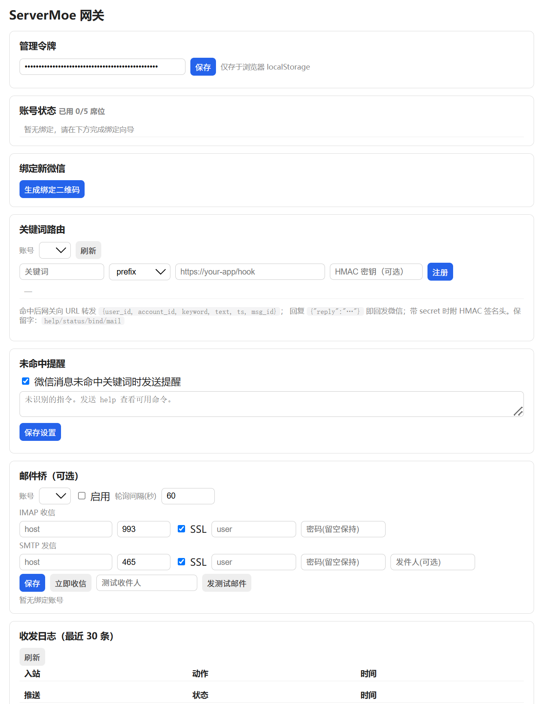

# ServerMoe（私有部署「Server酱」兼容）

一个可私有部署的微信消息网关：对外提供 **ServerChan（Server酱）完全兼容的零 SDK 推送 API**，
对内通过微信官方 OpenClaw 通道（ClawBot / 腾讯 iLink Bot API）送达你的微信聊天界面；
同时支持**反向关键词路由**（微信里发指令 → 转发到你的应用 → 回复直达微信）、可选邮件桥、
多用户与席位管理。

> 单二进制/单容器运行，数据全在本机；也可一键部署到 **Cloudflare Workers**（免费额度内 Serverless，见「方式六」）。个人自用、低频通知场景设计。

<p align="center">
  
</p>
<p align="center">
  
</p>

## 特性

- **零 SDK 推送**：`/{sendkey}.send`，与 Server酱 参数和响应结构兼容，老应用换 base URL 即迁移
- **反向关键词路由**：应用注册「关键词 → webhook」，微信发消息即触发，回复直达微信（HMAC 签名、5s 超时、失败回执）
- **邮件桥（可选）**：IMAP 收信转微信、`mail:send` 关键词经 SMTP 发信
- **多用户**：多微信号同时在线，每账号独立 sendkey/关键词/邮件配置，席位上限可控
- **推送窗口临期提醒**：微信侧限制「用户 24h 内没发过消息则 bot 无法推送」，可按账号开启临期提醒（自定义文案与提前量），到期前自动请你回复一条消息续期窗口
- **自动更新检测**：管理页按可调频率访问 GitHub Release，发现新版本即在页面顶部展开提示（自构建版自动跳过）
- **免运维语义**：重启免重扫、掉线自动重试、二维码过期自动刷新、未预热推送排队自愈、token 失效熔断标记
- **安全**：sendkey 仅存哈希、凭据 AES-256-GCM 加密落盘、webhook HMAC 签名、管理接口鉴权

## 快速开始

### 方式一：Docker Hub 拉取（最快）

```bash
docker pull lbls741/servermoe:latest
docker run -d --name servermoe -p 8080:8080 -v servermoe-data:/data lbls741/servermoe:latest
curl http://localhost:8080/healthz
```

管理页 `http://localhost:8080/`；未传 `MOE_ADMIN_TOKEN` 时首启会自动生成，`docker logs servermoe` 查看。
无外网环境可用 Release 附带的镜像离线包（见「方式六：离线安装」）。

### 方式二：本地构建（Docker Compose）

```bash
cp .env.example .env   # 填 MOE_SECRET / MOE_ADMIN_TOKEN（或留空自动生成后从日志取）
docker compose up -d --build
```

### 方式三：裸 Linux 一键部署

一行命令安装（nvm 风格）。脚本先自动配置环境——安装 Bun、创建系统用户与数据目录、
生成 `/etc/servermoe.env`——随后出现键盘菜单（↑/↓ 移动，Enter 确认）选择安装方式：

```bash
curl -fsSL https://raw.githubusercontent.com/lbls741/ServerMoe/main/scripts/deploy.sh | sudo bash
```

- **从正式版安装**（默认选中）：访问 GitHub 获取最新 Release 并在终端显示版本号，下载随
  Release 发布的运行时包（`servermoe-<tag>-runtime.tar.gz`，src + 生产依赖，免装依赖）安装，
  自动注入 `MOE_VERSION` 以启用管理页的更新检测；
- **从源码安装**：复用传统路径——使用当前目录已上传的项目源码（远程执行时自动 `git clone`），
  `bun install` 后运行（自构建版，跳过更新检测）。

也可非交互指定动作与方式：

```bash
sudo bash scripts/deploy.sh install release          # 从最新正式版安装
sudo bash scripts/deploy.sh install release 0.2.1    # 安装指定版本
sudo bash scripts/deploy.sh install source           # 从源码安装
sudo bash scripts/deploy.sh update                   # 按首次安装的方式更新（正式版模式自动拉最新 Release）
curl -fsSL https://raw.githubusercontent.com/lbls741/ServerMoe/main/scripts/deploy.sh | sudo bash -s update
                                                     # 正式版模式远程更新（服务器上无需留源码）
sudo bash scripts/deploy.sh status                   # 服务状态与健康检查
sudo bash scripts/deploy.sh uninstall                # 卸载（数据保留）
```

细节见脚本头部注释。数据落在 `/var/lib/servermoe`，配置在 `/etc/servermoe.env`。

### 方式四：本地开发

```bash
bun install
bun run dev            # http://localhost:8080（--hot 热重载）
bun test test/         # 102 项测试
bun run typecheck && bun run lint
```

### 方式五：Cloudflare Workers（免费额度内 Serverless）

无服务器形态：HTTP API 跑在 Workers 上，状态（账号凭据/游标/日志）存 **D1**，
微信侧消息靠**定时收割**获得（iLink 协议没有回调机制，详见「入站轮询」）。

```bash
bun install
bunx wrangler d1 create servermoe   # 把返回的 database_id 填入 wrangler.jsonc
bunx wrangler secret put MOE_SECRET # 建议显式设置主密钥（跳过则自动生成并入库，安全性弱一档）
bun run deploy                      # = wrangler deploy（首次部署自动建表，幂等 DDL）
```

部署完成后打开 `https://servermoe.<你的子域>.workers.dev/` 进入管理页，绑定流程与自部署完全一致。

**入站轮询**（管理页「入站轮询」区可改间隔，无需重新部署）：

| 策略 | `MOE_INGEST_MODE` | 机制 | 最低间隔 |
|---|---|---|---|
| 定时收割（默认） | `cron` | Cron Trigger 每分钟唤醒，按设置间隔门控收割 | 60 秒 |
| Durable Object | `do` | 每个 bot 账号一个 DO 单例，alarm 链自驱收割 | 10 秒 |
| 按需收割（叠加） | `MOE_ONDEMAND_HARVEST=on` | 未预热时推送前抢租约做一次 ≤5s 短收割，收到消息即重试发送 | — |

**免费额度速算**（Cloudflare Free，均为量级估算）：

- cron 每分钟触发 ≈ 1,440 请求/天 ≪ 100,000 请求/天；
- 游标/节拍戳/限频桶写入 D1 ≈ 每天数千行 ≪ D1 免费额度（100,000 写/天）。**不使用 KV**——其免费额度仅 1,000 写/天，1 分钟级轮询反而必超；D1 让「免费计划跑 1 分钟级收割」没有额度压力，频率只影响捕获延迟；
- `do` 模式 DO duration：active 时长 ≈ 收割挂起时长。60s 间隔 ≈ 6,300 GB-s/天（免费 13,000 内），300s 间隔 ≈ 1,260；连续长轮询的常驻模式 ≈ 10,800 GB-s/天（占 83%），故默认用 alarm 链而非常驻。

**与自部署的能力差异**：邮件桥不可用（IMAP/SMTP 长连接，相关端点返回 501）；更新检测无意义（部署即最新版本）；限频用 D1 持久令牌桶（多隔离体共享计数）。自部署两种形态的差异在配置层自动收敛：`MOE_INGEST_MODE` 设错方向时自动回退并告警。

### 方式六：离线安装（GitHub Release 产物）

每个 Release 附带两类产物，适合无外网的服务器或供部署脚本下载：

| 产物 | 用途 |
|---|---|
| `servermoe-<tag>-docker-amd64.tar.gz` | Docker 镜像离线包（linux/amd64），`docker load` 直接导入 |
| `servermoe-<tag>-docker-arm64.tar.gz` | Docker 镜像离线包（linux/arm64，适用于树莓派 / ARM 服务器 / NAS），同上 |
| `servermoe-<tag>-runtime.tar.gz` | 运行时包：`src` + 生产依赖（不含文档/测试），架构无关，解压后由 Bun 直接运行，无需再装依赖 |

```bash
# Docker 离线导入（uname -m 确认架构：x86_64 → amd64，aarch64 → arm64）
docker load -i servermoe-<tag>-docker-<arch>.tar.gz
docker run -d --name servermoe -p 8080:8080 -v servermoe-data:/data lbls741/servermoe:<tag>

# 裸机运行时包（需 Bun ≥ 1.4）
tar xzf servermoe-<tag>-runtime.tar.gz            # 解出 servermoe/
cd servermoe && MOE_VERSION=<tag> bun run src/index.ts
```

## 初始化流程

1. 打开管理页 `http://<host>:8080/`，填入 `SSC_ADMIN_TOKEN` 保存；
2. 「生成绑定二维码」→ 手机微信（8.0.70+）扫码 → 如有配对数字则填入 → 完成绑定，**保存 sendkey**（仅显示一次）；
3. **预热**：在微信里给 ClawBot 发任意一条消息（推送的前置要求，未预热会排队自动补发）；
   微信侧还要求**每 24 小时内至少回复一条消息**，否则推送窗口过期（可在管理页账号区开启「临期提醒」）；
4. 用任意语言一行请求推送：

```bash
curl "http://<host>:8080/MOExxxxxxxx.send?title=构建完成&desp=**耗时** 3s"
```

## 反向控制（关键词路由）

应用注册「关键词 → 回调地址」后，微信里发消息即触发转发，应用返回
`{"reply":"…"}` 会直接出现在微信里。完整协议、HMAC 验签代码、限制与最佳实践见
**[docs/integration.md](docs/integration.md)**（反向控制接入文档），
可运行的零依赖示例见 [examples/keyword-receiver](examples/keyword-receiver/)。

## ServerChan（Server酱）迁移指南

| Server酱 | ServerMoe | 说明 |
|---|---|---|
| `https://sctapi.ftqq.com/{SENDKEY}.send` | `http://<网关>/{sendkey}.send` | 只换域名，参数/响应结构一致 |
| 免费 5 条/天 | 自托管默认 60 次/时（可调） | 限额在网关侧执行 |
| 单向推送 | 推送 + 关键词反向路由 + 邮件桥 | 新能力按需启用 |

注意：官方 `serverchan-sdk` npm 包把 `https://sctapi.ftqq.com` **硬编码在源码里**，无法通过配置换 base URL——因此基于该 SDK 的应用需要改一行代码才能指向本网关
如果你是普通用户，也许可以考虑使用本地代理，把请求导向本项目的实例。

## 配置项（环境变量）

| 变量 | 默认 | 说明 |
|---|---|---|
| `SSC_PORT` / `SSC_HOST` | 8080 / 0.0.0.0 | 监听地址 |
| `SSC_DATA_DIR` | `data` | 数据目录（SQLite、凭据、主密钥） |
| `SSC_SECRET` | 自动生成 `data/secret.key` | 落盘加密主密钥；**丢弃 data 卷将无法解密已存凭据** |
| `SSC_ADMIN_TOKEN` | 首启生成并打印一次 | 管理页与管理接口令牌 |
| `SSC_TEXT_CHUNK_LIMIT` | 3000 | 单条消息分块上限（1800–4000） |
| `SSC_SEND_RATE_PER_HOUR` / `SSC_SEND_BURST` | 60 / 10 | 每 sendkey 限频 |
| `SSC_SEAT_LIMIT` | 5 | 可绑定账号数上限 |
| `SSC_LOG_LEVEL` / `SSC_BOT_AGENT` | info / ServerMoe | 日志级别 / 出站观测标识 |
| `MOE_VERSION` | 空（自构建） | 构建期版本号；官方镜像由 Release 流程注入。**为空即视为自构建版，跳过更新检测** |
| `MOE_UPDATE_REPO` | `lbls741/ServerMoe` | 更新检测指向的 GitHub 仓库（fork 用户可改指自己的镜像仓库） |
| `MOE_INGEST_MODE` | `resident` | 入站收割策略：`resident`（自部署常驻 monitor）/ `cron`（Workers 定时收割）/ `do`（Workers Durable Object）。设错方向自动回退并告警 |
| `MOE_POLL_INTERVAL_SEC` | 300 | 定时收割默认间隔（秒）。实际生效值以管理页「入站轮询」设置优先（60s–24h；do 模式可低至 10s） |
| `MOE_ONDEMAND_HARVEST` | `off` | 按需收割（方案3，`on`/`off`）：未预热时推送前自动短收割刷新 context_token（仅 cron/do 模式生效） |

## 版本与更新检测

- 管理页每次请求后端时，若「自动检测」开启且距上次检测超过阈值（默认 24h，可在管理页
  「版本与更新」区调整为 1 小时～每周），后端访问 GitHub Release API 查询 latest 版本号；
- 发现新版本时，管理页顶部会以展开动画显示「更新可用」窗格（当前版本、最新版本、跳转
  Release 页按钮）；GitHub 访问失败时展示「更新检测失败」提示；
- **自构建版**（未注入 `MOE_VERSION`，如源码运行、compose 本地构建）完全跳过检测逻辑，
  管理页长期展示「自构建版本，更新检测不可用」。裸金属源码部署（deploy.sh）也属自构建，
  如需更新检测可手动在 `/etc/servermoe.env` 中加入 `MOE_VERSION=<版本号>`；
- 检测结果落盘（`data` 卷），重启后在阈值内不重复请求；检测失败同样计入检测间隔，不会逐请求重试。

## 运维与故障恢复

| 场景 | 行为 |
|---|---|
| 进程/容器重启 | 凭据与同步游标落盘，自动恢复收发，**无需重新扫码** |
| 消息重复投递 | 按 `message_id` 去重，bot 自身回显自动忽略 |
| 未预热推送 | 返回 `code 450` 并进入 outbox，预热后自动补发（≤5 次/24h） |
| bot_token 失效（errcode -14） | 熔断暂停 1 小时并标记 `rebind_needed`，管理页重新扫码即可 |
| 24h 推送窗口过期 | 用户回复任意消息即自动恢复（无需重扫）；期间推送按 `code 450` 入 outbox；可开启「临期提醒」在到期前收到提醒消息 |
| 二维码过期 | 自动刷新（≤3 次）；多次失败终止会话，重新发起 |
| 日志保留 | push/inbound 日志默认保留 30 天，超时自动清理 |

**备份**：备份 data 目录（Docker 卷 `servermoe-data` / `/var/lib/servermoe`）= 备份一切；
**恢复**到新机器后无需重新绑定。丢弃数据目录等于重置（需全部重新扫码）。

**排查**：`docker logs ssc-gateway`（或 `journalctl -u ssc`）；管理页日志区可看路由与推送明细；
`bun scripts/inspect.ts` 可只读检视数据库。

## 安全说明

- 管理接口与绑定向导需要 admin token；sendkey 授予推送与关键词管理权限，泄露请立即「重置 sendkey」
- 账号凭据与 webhook secret 落盘均为 AES-256-GCM 密文
- 公网部署建议置于反向代理（HTTPS）之后，并收紧防火墙；`bot_agent` 出站标识可用 `SSC_BOT_AGENT` 自定义（仅观测用）
- 本项目定位**个人自用**：请勿多租户转售、高频群发，遵守微信侧服务条款

## 项目结构

```
src/
  channels/wechat/   iLink 协议层 + 绑定状态机 + 收信收割（harvest）+ 发送（唯一感知协议处）
  core/ingest.ts     入站收割调度：cron 节拍门控 / DO alarm / 按需收割租约
  api/               ServerChan 兼容层 + /api/v1 管理 API + 限频（内存桶 / D1 桶）
  router/            关键词匹配、webhook 转发、内置命令、入站路由
  mail/              邮件桥（IMAP 轮询 / SMTP 发信，后端可注入；仅自部署装配）
  web/               管理页（零构建 SSR）
  db/ repo/          SQLite（Drizzle）：自部署 bun:sqlite / Workers D1，同一 schema
  runtime/ entries/  装配层 + 两个平台入口（src/index.ts=Bun、entries/worker.ts=Workers+DO）
examples/keyword-receiver/   开发者接入 demo（零依赖 Node.js）
docs/integration.md          反向控制接入文档
scripts/deploy.sh            裸 Linux 一键部署
wrangler.jsonc               Cloudflare Workers 部署配置（D1 + Cron + DO）
```

技术栈：Bun / Cloudflare Workers + Hono + SQLite（bun:sqlite / D1，Drizzle）+ TypeScript。

## 开源协议

本项目以 **GPL-3.0-or-later** 发布（全文见 [LICENSE](LICENSE)）。运行时第三方组件均为宽松许可
（MIT / ISC / BSD-2/3 / Apache-2.0 / MIT-0），声明清单见
[THIRD-PARTY-NOTICES.md](THIRD-PARTY-NOTICES.md)（由 `scripts/list-licenses.mjs` 自动生成，升级依赖后请重新生成）。
以 Docker 镜像等二进制形式分发时，请一并携带 `LICENSE` 与 `THIRD-PARTY-NOTICES.md` 并保持源码可获取。

**免责声明**：本项目与腾讯、微信及其生态无任何隶属或合作关系；本项目不实现也不逆向微信客户端协议，
消息通道基于微信官方 OpenClaw 插件公开的 MIT 接口契约自研实现。使用本项目请自行遵守微信用户协议与
相关服务条款，因使用不当导致的账号限制或风险由使用者自行承担。
